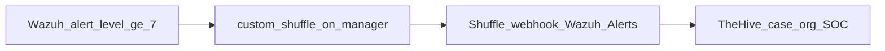

# How to see the integration in the UIs

We did **not** add a new panel inside Wazuh / Shuffle / TheHive.
Progress is **backend wiring**. You see **results**: Shuffle executions and TheHive cases.



---

## 1. TheHive (clearest place to look)

| | |
|--|--|
| URL | http://192.168.1.125:30090 (or http://10.8.0.2:30090) |
| Org | **SOC** (not the platform admin org) |
| User | `shuffle@soc.local` (see local `CREDENTIALS.txt`) |

Steps:

1. Log in and ensure organisation is **SOC**.
2. Open **Cases**.
3. Look for titles like `Wazuh [10] …` with tags `wazuh`, `shuffle`, `auto`.
4. Open a case — description has rule id, agent, full log, raw JSON.

**Verified snapshot (lab):** 19+ cases in org SOC, including  
`#19 Wazuh [10] sshd: brute force trying to get access to the system.`

If Cases look empty while using `admin@thehive.local`, switch to **SOC** — platform admin often cannot see those cases.

---

## 2. Shuffle (workflow + run history)

| | |
|--|--|
| URL | http://192.168.1.125:30080 |
| User | `admin` (password in `/home/maher/shuffle/CREDENTIALS.txt`) |

Steps:

1. Open workflows → **Wazuh Alerts**.
2. Graph should be: Webhook **Receive Wazuh Alerts** → HTTP **Create TheHive Case**.
3. Open **Executions** for that workflow.
4. Recent runs should be **FINISHED**; HTTP result **201** with a TheHive `number`.

**Verified snapshot (lab):** 19+ FINISHED executions linked to TheHive case numbers.

Webhook (not a UI page):  
`http://192.168.1.125:30080/api/v1/hooks/webhook_bab61144-db82-4ada-aacb-62fa34893206`

---

## 3. Wazuh Dashboard (looks unchanged on purpose)

| | |
|--|--|
| URL | https://192.168.1.125:31294 |

There is **no** “Shuffle” menu. Integration is on the manager:

- `ossec.conf` → `<integration><name>custom-shuffle</name>` (level ≥ 7)
- Scripts under `/var/ossec/integrations/custom-shuffle(.py)`

Smoke tests often POSTed straight to Shuffle, so they **do not** always create a new row under Wazuh → Threat Hunting / Alerts.

To see the **full** chain in all three UIs, generate a **real** alert with rule level ≥ 7 (see below), then refresh Shuffle executions and TheHive Cases within ~30 seconds.

---

## 4. Generate a live Wazuh alert (full chain)

On the cluster host:

```bash
# Option A — replay integrator with a Wazuh-shaped alert file (exercises scripts + Shuffle + TheHive)
kubectl -n wazuh exec wazuh-manager-master-0 -- bash -lc '
ALERT=/tmp/ui-walkthrough-alert.json
cat > "$ALERT" <<EOF
{"rule":{"id":"5710","level":10,"description":"sshd: attempt to login using a non-existent user","groups":["authentication_failed","sshd"]},
 "agent":{"id":"000","name":"wazuh-manager-master-0"},
 "location":"sshd","full_log":"Invalid user walkthrough from 203.0.113.50 port 22",
 "id":"ui-walkthrough","timestamp":"2026-08-09T14:00:00.000+0000"}
EOF
HOOK="http://shuffle-backend.shuffle.svc.cluster.local:5001/api/v1/hooks/webhook_bab61144-db82-4ada-aacb-62fa34893206"
timeout 15 /var/ossec/integrations/custom-shuffle "$ALERT" x "$HOOK"
'
```

Then:

1. Shuffle → **Wazuh Alerts** → Executions → newest **FINISHED**.
2. TheHive (org **SOC**) → Cases → newest `Wazuh [10] sshd: attempt to login using a non-existent user`.

For a true analysisd-generated alert (also visible in Wazuh Dashboard), trigger the monitored auth/syslog path on an agent (e.g. failed SSH as a non-existent user) so rule **5710** (level 10) fires; integrator then runs automatically.

---

## 5. Why it felt like “nothing new”

| Expectation | Reality |
|-------------|---------|
| New button in Wazuh | No — integrator config/scripts only |
| Cases under admin org | Cases live in org **SOC** |
| Wazuh Alerts for every smoke test | Many tests bypassed Wazuh analysisd |
| New Shuffle home widget | Only workflow **Wazuh Alerts** + executions |

See also [PROGRESS.md](PROGRESS.md) and [ARCHITECTURE.md](ARCHITECTURE.md).
